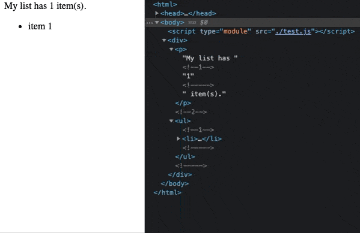

![template header][0]

# `template`

[][1]
[][2]
[][3]
[][4]
[][5]
[][6]

Simple HTML template engine for vanilla WebComponents.

- [`template`][7]
  - [Add Github Packages to your registry][8]
  - [Installation][9]
  - [Import][10]
    - [UMD Version][11]
    - [ES Module][12]
    - [CommonJS version][13]
  - [Using a template][14]
    - [Creating a template: `html` function][15]
    - [Rendering into a container][16]
    - [Full example][17]

---

### Add Github Packages to your registry

Create or edit the `.npmrc` file in the same directory as your `package.json` and include the following line:

        registry=https://npm.pkg.github.com/elementumjs

### Installation

Install via `npm`:

        npm install @elementumjs/template

### Import

#### UMD version

[UMD](https://github.com/umdjs/umd) builds can be used directly in the browser via a `<script>` tag. Dowloading the package with `npm` or using the jsDelivr CDN:

```html
    <!--<script src="/node_modules/elementumjs/template/dist/template.umd.js"></script>-->
    <script src="https://cdn.jsdelivr.net/gh/elementumjs/template/dist/template.umd.js"></script>
    <script>
        // Template.html...
    </script>
```

#### ES Module

[ES Module](http://exploringjs.com/es6/ch_modules.html) builds are intended for use with modern bundlers like [webpack 2](https://webpack.js.org) or [rollup](http://rollupjs.org/). Use it with ES6 JavaScript `import`:
  
```javascript
    import { html, val } from '@elementumjs/template';
```

#### CommonJS version

[CommonJS](http://wiki.commonjs.org/wiki/Modules/1.1) builds are intended for use with older bundlers like [browserify](http://browserify.org/) or [webpack 1](https://webpack.github.io). Use it with `require` funtion or similar:

```javascript
    var Template = require('elementumjs/template');
    // Template.html...
```

### Using a template

#### Creating a template: `html` function

To define and init a new `Template`, you need to use the `html` template tag:

```javascript
    import { html, render } from '@elementumjs/template';

    const template = (counter) => html`<h1>Counted ${ counter } times</h1>`;
```


#### Rendering into a container

To render the template into a container Node, the data to fill the template is passed as attribute to the template generator function. The result of that function will be parsed by `render` function to check if the template is already rendered and update it or is not rendered yet and inject it.

```javascript
    import { html, render } from '@elementumjs/template';

    // const template = ...;

    let counter = 0;
    render(template(counter), document.body /* the container to render the template */);
```

#### Full example



```javascript
    import { html, render } from '@elementumjs/template';

    // Create the template
    const template = (counter) => html`<h1>Counted ${ counter } times</h1>`;

    // Instance the value and render the template into the container.
    let counter = 0;
    render(template(counter), document.body);

    // Update the value and render the template
    let loop = setInterval(() => {
        counter++;
        render(template(counter), document.body);

        if (counter == 10) clearInterval(loop);
    }, 1000);
```

[0]: assets/header.png

[1]: https://cdn.jsdelivr.net/gh/elementumjs/template/dist/template.umd.js

[2]: https://github.com/elementumjs/template/packages/

[3]: https://github.com/elementumjs/template/actions?query=workflow%3Aproduction

[4]: https://github.com/elementumjs/template/actions?query=workflow%3Adevelop

[5]: REFERENCE.md

[6]: LICENSE

[7]: #template

[8]: #add-github-packages-to-your-registry

[9]: #installation

[10]: #import

[11]: #umd-version

[12]: #es-module

[13]: #commonjs-version

[14]: #using-a-template

[15]: #creating-a-template-html-function

[16]: #rendering-into-a-container

[17]: #full-example

[18]: assets/demo.gif
